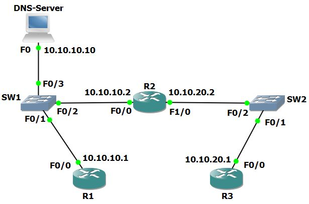
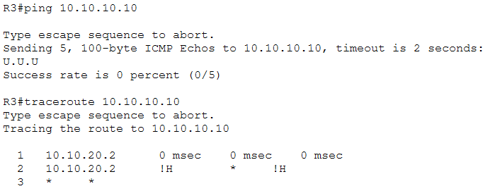
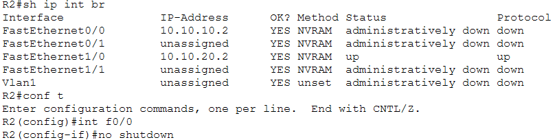
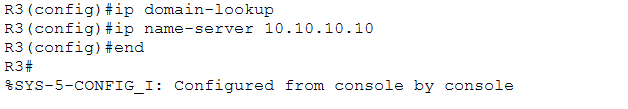
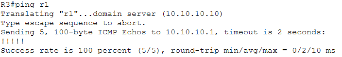

# CCNA Troubleshooting Lab: Fixing a Broken DNS and Connectivity Problem

I did this lab in September 2026 while studying for my CCNA, and it's the first troubleshooting lab I documented. The assignment was to use the Cisco troubleshooting methodology to find and fix a broken network and then write up the solution, which is the part that made me slow down and actually look at my own process.

On paper the problem was simple. DNS was "broken," meaning R3 couldn't ping R1 and couldn't use DNS to resolve its hostname. In reality it was three separate problems stacked on top of each other, so every time I fixed one, the next one showed up.

## The Setup

The network has three routers, two switches, and a DNS server, and I built it in Cisco Packet Tracer. R1 (10.10.10.1) and the DNS server (10.10.10.10) both connect to SW1, which also connects to R2's f0/0 interface (10.10.10.2). On the other side, R2's f1/0 interface (10.10.20.2) connects through SW2 to R3 (10.10.20.1). That makes R2 the only path between the two networks, which ended up mattering a lot.



Looking back, the three problems were the DNS service on the server being turned off, R2's f0/0 interface being administratively down, and R3 not having the commands it needs to use DNS. Each one lived in a different spot, and each one hid the next.

## How It Went

I started at Layer 4, using Telnet to test whether port 53 was reachable on the DNS server's IP address. I fixed that issue by going into the DNS configuration and turning on the DNS service.

When that didn't fix the problem, I sent a ping from R3 to the DNS server. The ping failed, so I used traceroute to find the break in connectivity.



The traceroute stopped at R2 (the ping came back with U's and the traceroute with !H, which from my understanding means R2 was answering with "unreachable" messages instead of passing the traffic along). So the issue seemed to be at R2, and I went into privileged exec mode and used the `show ip interface brief` command.



R2's f0/0 interface, the one connecting it to the 10.10.10.0/24 network, was administratively down, so I used the `no shutdown` command to enable it. DNS was working for R1 and R2, but still not for R3.

I tried making sure the routes were properly configured and that DNS was properly turned on, and by then the ping to 10.10.10.10 from R3 was working. The issue was just DNS.

Then I remembered the two commands that need to be enabled on a device for DNS to work, `ip domain-lookup` and `ip name-server`. After running `ip domain-lookup` and `ip name-server 10.10.10.10` on R3, DNS was finally working.





## Step by Step

### 1. Define the Problem

DNS was "broken." R3 (10.10.20.1) couldn't ping R1 (10.10.10.1) or use DNS to resolve its hostname.

### 2. Gather Information

- (Layer 4) I used Telnet to see if port 53 on 10.10.10.10 (the DNS server) was open. It was not available.
- (Layer 3) I sent a ping from R3 to the DNS server, and it didn't work.
- (Layer 3) I sent a ping from R3 to R1, and it didn't work.
- (Layer 3) I sent a traceroute from R3, and the packets reached R2 and then stopped.

### 3. Analyze Information and Test Hypothesis

I skipped "eliminate possible causes" and "propose hypothesis," which may or may not have helped me when I was going in loops trying to figure out why DNS was still down after I thought I had fixed everything.

Since port 53 was down on 10.10.10.10, I opened the DNS server, went to the Services tab, and found that the DNS service was off. I enabled it and tried to ping R1 from R3, which still failed.

Next I investigated R2, since that's where connectivity dropped during my earlier pings. Using `show ip interface brief`, I found that the f0/0 interface that connects R2 to the 10.10.10.0/24 network was disabled, so I used `no shutdown` to enable it.

After this, I was able to ping 10.10.10.10 (the DNS server) and 10.10.10.1 (R1) from R3, but DNS name resolution was still not working on R3. I tested pinging the hostnames r2 and r3 from R1, and pinged r1 and r3 from R2, and those pings and DNS requests resolved. I double (maybe quadruple) checked the DNS server to no avail.

### 4. Solve the Problem

I finally realized, "what if the commands for using DNS on R3 haven't been applied?" I rushed to R3's CLI and typed `ip domain-lookup` and `ip name-server 10.10.10.10`. After this, I tried a `ping r1` from R3, and it worked! It turned out this was a Layer 4, Layer 3, and device configuration troubleshooting issue.

## How This Fits the Cisco Methodology

The Cisco troubleshooting methodology has eight steps: define the problem, gather information, analyze the information, eliminate possible causes, propose a hypothesis, test the hypothesis, solve the problem, and document the solution. In this lab I defined the problem, gathered information with Telnet, ping, and traceroute, analyzed what those results pointed to, tested my fixes one at a time, solved it, and documented it here.

Eliminating causes and proposing a hypothesis are the two steps I skipped, and honestly, that is where most of my wasted time came from.

## Commands I Used

The commands that did the work were `telnet 10.10.10.10 53` to check whether the DNS server was listening, `ping` and `traceroute` from R3 to find where connectivity stopped, and `show ip interface brief` on R2 to check the status of its interfaces (which is how I caught f0/0 being administratively down). I fixed that with `no shutdown`, and then finished the job on R3 with `ip domain-lookup` (turns on DNS name lookups) and `ip name-server 10.10.10.10` (points the router to the DNS server).

## Skills Used

Network troubleshooting, the Cisco troubleshooting methodology, layered (OSI) troubleshooting from Layer 4 down to Layer 3, ping, traceroute, and Telnet port testing, Cisco IOS CLI (privileged exec mode, `show ip interface brief`, interface management), DNS configuration on a server and on Cisco routers, connectivity verification, Cisco Packet Tracer, technical documentation

## What I Learned

**Follow the methodology, even when the problem looks easy.** I skipped "eliminate possible causes" and "propose hypothesis," and I think that is exactly why I kept going in loops when DNS was still down. Writing down a hypothesis before touching anything would have saved me a lot of time.

**One symptom can have more than one cause.** "DNS was broken" was really three separate faults, and fixing the first one didn't fix the rest.

**Compare what works with what doesn't.** R1 and R2 could resolve names and R3 couldn't, which told me the DNS server was fine and the problem was on R3 itself.

**Match the tool to the layer.** Telnet showed me the port was closed (Layer 4), ping told me the path was broken, and traceroute showed me where it broke (R2), which is a lot more useful than just knowing the ping failed.

## Repo Contents

```
.
├── README.md
└── images/
    ├── 00-lab-topology.png
    ├── 01-ping-and-traceroute-from-r3.png
    ├── 02-r2-interface-status-and-no-shutdown.png
    ├── 03-r3-dns-commands.png
    └── 04-r3-ping-r1-by-name.png
```
